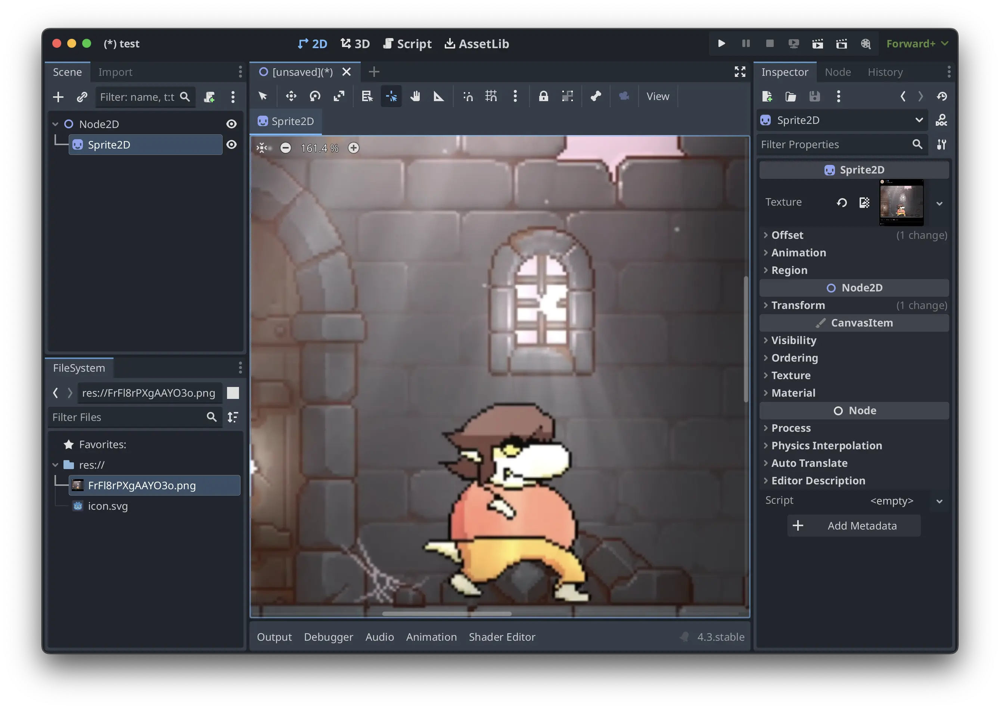
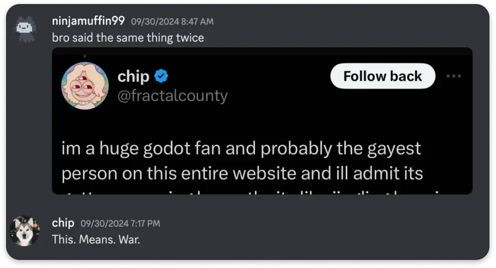
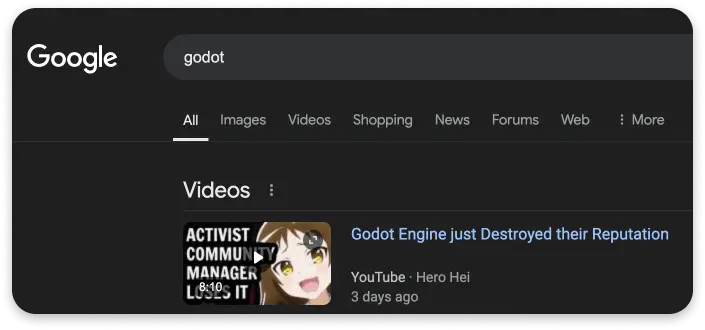
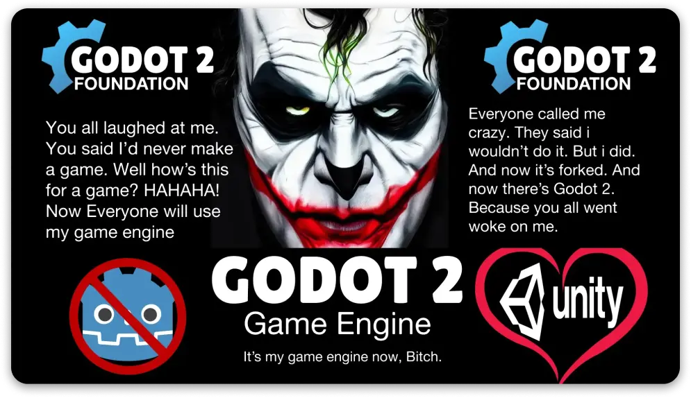
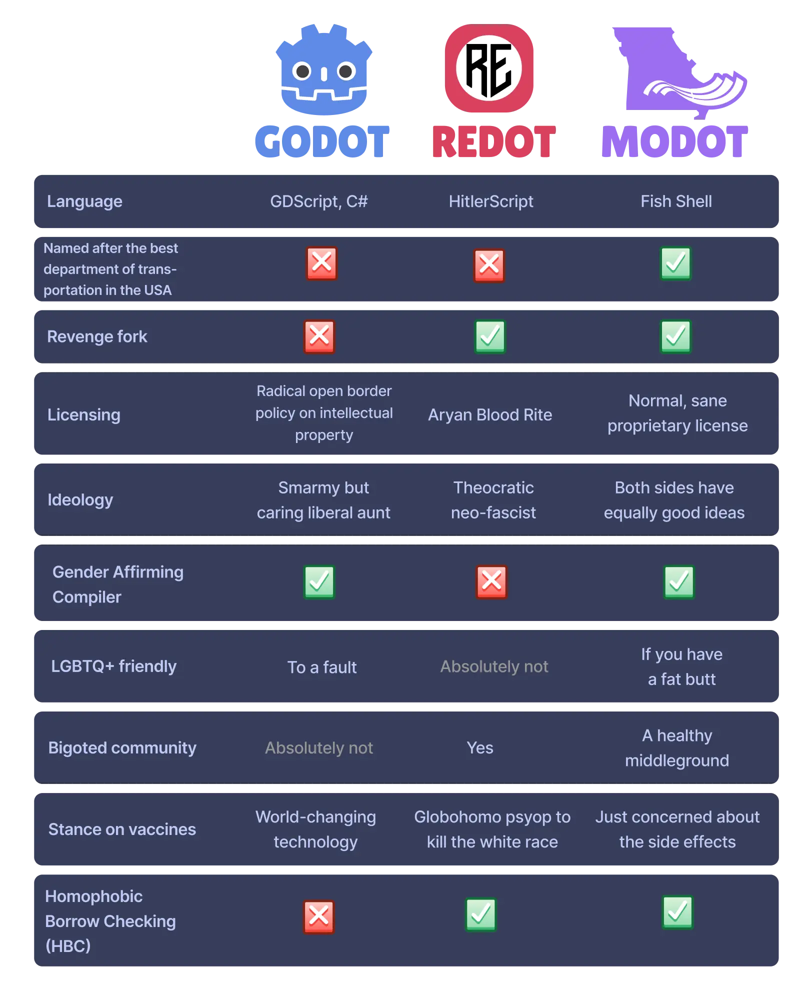
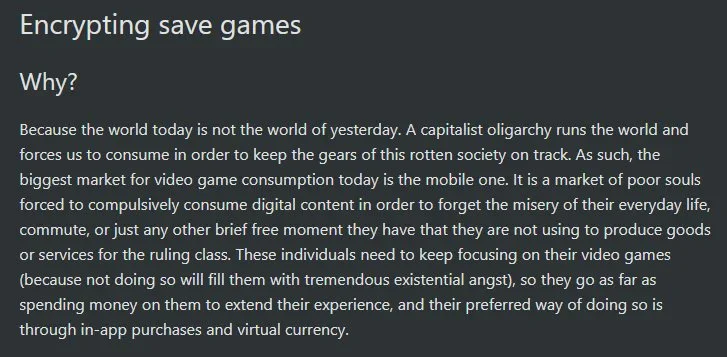

_A screenshot from a game I abandonded in 2023_

import { Tweet } from 'astro-embed';

---

## Foreword

While this post is going to sound very critical towards Godot, its community, and its leadership, I need to preface this by saying a few things:

- I've been an avid user of the engine since around 2021 and have had nothing but good things to say about the project. Seriously, ask any of my friends and they will attest how many times I've shilled Godot to them.
- I've been a gay person for even longer, so I encourage you to leave any percieved biases at the door before continuing.

**Note**: If you already know what happened, **please skip to the [actual opinion stuff](#the-actual-opinion-stuff)**.

---

## What happened?

It all started with this banger tweet from the official Godot Twitter account:

<Tweet id='https://x.com/godotengine/status/1839656658932306395' />

Opinions on this tweet were polarizing at best and ranged from "the cancer killing the engine" to "the funniest thing since boykisser" with little inbetween. Most Godot users fell into the latter category. Personally, I found it sort of funny, but maybe in an eye-rolling sort of way. Not everyone felt the same way, however.

### The First Plane Hits

Apparently, it was so noxious to that [Grummz](https://x.com/Grummz), a literal who grifter with a full-time job complaining about "localizers" and other [Shit Nobody Cares About](https://wiki.soyjak.st/Shit_Nobody_Cares_About), saw it as the perfect opportunity to revive his dream of Gamergate 2 despite having no idea what Godot was 5 seconds earlier:

<Tweet id='https://x.com/Grummz/status/1840398940241604648' />

Before anyone could even react, more trouble was brewing.

### The Second Plane Hits

In this case, the plane was the [N word](https://en.wikipedia.org/wiki/Nigger) and the pilot was a former moderator of what used to be the official Godot Discord server:

<Tweet id='https://x.com/GamesNosh/status/1840499469160190381' />

Once every game developer on Twitter had already moved on and went back to making games, the Godot Foundation made an official statement for everyone else:

<Tweet id='https://x.com/godotfoundation/status/1840721449364988300' />

To paraphrase the statement:

- Stop harassing us over the Wokot tweet.
- We accidentally blocked some users on accident.
- We will still ban you from the community if you're a [stupid fucking chud](https://www.youtube.com/shorts/vxKiKS925kE)
- We have no responsibility for the actions of the redpilled moderator.

### The Aftermath

Now, when you search `godot controversy` on Google, you'll mostly find articles focusing on the Foundation's response to the N word stuff instead of the actual incident. Oh, and whatever this is, I guess:

_Even child molesters are joining in on the kerfuffle!_

### The Fork

For those who are still confused with the forking schenanigans, here's a comparison of the most popular Godot forks as of time of writing:

---

## The actual opinion stuff

### I. Introduction

Godot is at a crossroads. While it has gained immense popularity for its open-source philosophy and friendly community, these controversies have highlighted a critical issue: anything but a laser-focus on game development undermines the core mission of any good game engine.

**The Godot Foundation should take after other open-source projects by drastically reducing their involvement in community management.**

### II. Topics

What does the Godot Foundation actually do? Well, a lot actually. Way more than most people would realize, I'd assume. For starters, they oversee the development and maintenance of Godot while providing resources and strategic direction to its userbase. The Foundation is deeply entwined in both the technical development and the day-to-day management of its community.

In part, the Godot Foundation represents a trinity of sorts:

- Godot the Engine: The father. The tool that allows you to make games.
- Godot the Community: The son. The online diaspora of Godot developers spread across the official subreddit, Discord server, Twitter account, and more.
- Godot the Movement: The Holy Spirit. The collective unconscious of the Free Software Movement finally embodied through a rightous, socially-conscious game engine.

However, I propose that it's time for Godot to sever its connection to its Holy Spirit and Community and just focus on being just a game engine.

From a purely external perspective, the Godot Foundation often comes across as spending more time posturing itself than actually doing anything.

### III. Inherency

Explain why why the status quo is not ideal or sustainable:

#### Discord

- Notoriously difficult to moderate
- High-risk, low-reward resources prone to becoming cesspools
- Invites massive amounts of risk that is prone to reflecting poorly on the project
- Requires intense micromanaging and meticulously grooming to just barely keep it constructive
- Server isn't exactly the place I'd want to represent my community with
- Feels less like a professional development community and more like my high school GSA meetings
- Moderation style is just overbearing enough to make even the most well-intentioned users feel like they're walking on egghsells
- Moderation style is just unfocused enough to reduce its value for users who strictly want a helpful resource
- Like all public discord servers, it attracts people who enjoy using discord more than they do the tool itself
- Really a quite jarring place for older users who might be used to other development communities

#### Twitter

- People fail to understand is the risk involved in representing your entire project and community on Post-Musk Twitter.
- The "wokot" situation is proof that at any given moment, there is a horde of grifters at your doorstep eager to launch an all-out attack on you the _second_ you fumble.
- Before you know it, they've turned your project into the active battleground of their lame culture war and dragged your userbase into an obnoxious (and often dangerous) culture war.
- Regardless of the fact that these people are, objectively, acting in bad faith, **any** amount of perceived "drama" and instability surrounding a project will still reflect poorly on it in the eyes of uninformed outsiders.
- Posting on Twitter is simply not worth it.

#### Politics

> The supreme art of war is to subdue the enemy without fighting."
>
> Sun Tzu, "_The Art of War_

- while the godot foundation's periodic reminders that they don't hate 80% of its userbase's guts is a nice sentiment, godot needs to be more tactful
- the wokot tweet wasn't an example of godot valiantly fighting on the forefront of a liberation movement, it was a quick and easy way to generate trust and engagement in their project by validating a significant portion of the userbase
- godot goes out of their way to talk about political issues even if they have nothing of substance to say
- and yes, like it or not, human rights _are_ inherently a political issue

---

Mortal of inherency: All of these things are **inherently** not worth it!

---

### V. Solvency

What should Godot do?

- Godot should stop investing effort and resources into generating community engagement and, if anything, focus **solely** on events, news, and showcasing games like they mostly do already.
- Godot should reconsider their role as community managers and stop investing effort into managing official discord servers.

### VI. Advantages

1. Improved public image and reduced controversy
2. More focused development community
3. Reduced risk of project fragmentation

_This one is honestly really funny if you imagine the author decided to pull off an ironic Joker bit in the middle of a serious engine document for no reason_
