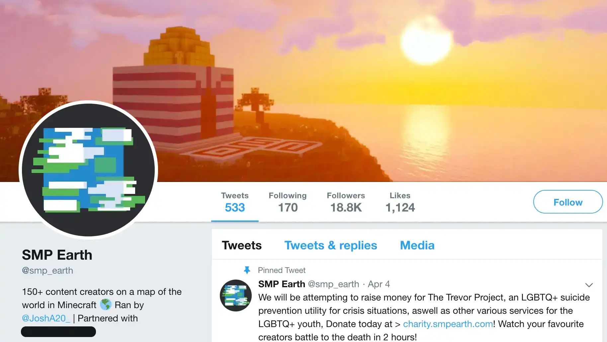

import { Image } from 'astro:assets'

import Tweet from '@components/Tweet.astro'
import DiscordMessage from '@components/DiscordMessage.astro'
import DiscordConversation from '@components/DiscordConversation.astro'
import ImageCard from '@components/ImageCard.astro'
import ContentImage from '@components/content/ContentImage.astro'
import ContentVideo from '@components/content/ContentVideo.astro'

[SMPEarth](https://smpearth.fandom.com/wiki/SMPEarth) was a private Minecraft server set on a scale map of Earth that I created in high school, designed specifically for content creators to livestream on.

While most would anticipate drama from a project in which hundreds of online personalities are forced to interact with each other, the sheer complexity of its history and behind-the-scenes conflicts would exceed even the most cynical expectations. Unsurprisingly, it was also my experience being in any sort of leadership position whatsoever.

SMPEarth was the direct successor of two other Minecraft servers:

1. [SMPLive,](https://youtube.fandom.com/wiki/SMPLive) a private SMP with a similar premise based around live-streaming which was approaching the end of its life at the time.

2. [/int/craft,](https://intcraft.wiki/intcraft) a geopolitical roleplaying Minecraft server founded in 2015 by users of 4chan's [/int/](https://www.4chan.org/) board that has had various iterations over the years.

<ContentImage
  src={'./intcraft-mascot.webp'}
  style={false}
  alt='/int/chan, the official mascot of /int/craft'
/>

It all started when my left testicle swelled up to the size of a grapefruit.

Okay, that's not true. It was actually about the size of a large plum, but still. I was recovering from [scrotum surgery](https://my.clevelandclinic.org/health/treatments/16232-hydrocelectomy) around October of 2019 and was bedridden for a good part of the month. Naturally, I spent a lot of time bored out of my mind on the internet.

The idea for SMPEarth emerged shortly after I had become acquainted with some of the original members of SMPLive. They were disappointed that the SMP was slowly losing traction despite Minecraft's momentary resurgence in popularity.

Coincidentally, around the same time, I was reminded of a controversy surrounding a user I played with on /int/craft, [WolfDevon,](https://intcraft.wiki/wolfdevon/) who had [converted to Islam and murdered his neo-nazi roommates.](https://www.rollingstone.com/politics/politics-news/all-american-nazis-628023)

<ContentImage
  src='./smpearth-devon-arthurs.webp'
  alt='be careful who you invite to your Minecraft server, I guess'
  size='sm'
/>

Really, I just wanted to play Minecraft with my friends.

---

## Foreword

This article is a compilation of personal writings about SMPEarth that I've collected over the years. Some of it is very dated and all of it is very opinionated.

Although I originally planned on revising it for clarity and accuracy, I've decided to present the text in its original form to accurately preserve the level of seething I was doing at the time. Aside from some very minor grammatical edits and structural changes, the original text is otherwise unaltered. Any future revisions will be seperate and/or [clearly indicated.](#edit-history)

The rest of this page's content should be interpreted as an informal diary entry rather than a definitive overview of the project's development history. Due to the passage of time and my lack of archiving habits back then, most of the content here lack proper sources and citations. Any statements or claims made are based on the recollections of my teenage self and should not be interpreted as established fact or used as the basis for any legal, financial, or other consequential decisions.

If anything, it's at least an accurate glimpse into my mindset when I was still seething over the whole situation.

---

## In the beginning

The idea of SMPEarth was concieved in an Among Us hosted in [JunkyJanker's](https://www.youtube.com/@JunkyJanker) Discord server, _Funny Club_.

To give some context, I had been introduced to the group only a few weeks prior after I created a [SMPLive cartoon](https://www.youtube.com/watch?v=hz589iet7WQ) that had picked up traction. Admittedly, I made the cartoon before I was even that familiar with SMPLive or its community- I was mostly just looking for an excuse to make a cartoon.

Oh, and I also really wanted to get on SMPLive.

I don't think anyone from that group would disagree that we were all at least _a little_ clout-motivated back then. Which, to be fair, isn't an abnormal trait amongst a bunch of teenage storytime animators and YouTubers. That being said, I definitely had the cheapest approach. While they patiently built their audiences through consistent effort, I chased arbitrary goals through clever schemes and schenanigans. Needless to say, the fact that most of them went on to build successful careers should speak volumes as to which approach panned out better.

Fortunately, I was suprised to hear that some of the members of _Funny Club_ had already reccomended me for SMPLive before I had even joined the server. Unfortunately, the server was already approaching its end of life by the time I entered the picture, dashing any aspirations of clout that I had.

Like many others throughout this story, I was unable to resist the forbidden fruit.

<Tweet
  src='/images/blog/smpearth/smpearth-origin-tweet.webp'
  text='Idea: a live streaming event like SMP Live expect the map is a 1:2000 scale map of the world and players compete within nations and cities via towny/factions. Imagine the memes, wars, and geopolitical insanity'
  likes='1,184'
  replies='213'
  retweets='124'
  imageUrl='/src/content/blog/smpearth/smpearth-map.webp'
/>

## Let there be light

My friends were on board the second I blurted out the idea. [JunkyJanker](https://www.youtube.com/@JunkyJanker) started selling the idea of "Earth SMP" to everyone he knew before we had even settled on a name. [LukeOrSomething,](https://youtube.fandom.com/wiki/LukeOrSomething) [RobTob,](https://youtube.fandom.com/wiki/RobTob) [InkTea,](https://youtube.fandom.com/wiki/InkTea) and [BrodyAnimates](https://youtube.fandom.com/wiki/BrodyAnimates) had already started helping me work on a pitch document. [stann.co](https://x.com/stann_co) didn't do anything but would feel sad if I didn't mention him. And everyone else did a lot of the same that I honestly don't even remember at this point.

Eventually, [Wilbur Soot](https://en.wikipedia.org/wiki/Wilbur_Soot) got on board and agreed to effectively "sponsor" the project by getting the bulk of creators from SMPLive on board. Within a few hours of announcing the project, he had already bagged [40+ confirmed members.](https://www.reddit.com/r/smplive/comments/dzslsk/list_of_possible_members_of_smpearth_from_wilburs/)

---

**10/5/2024 Edit:** Unfortunately, like most projects involving a massive group of content creators, SMPEarth's history is also marred by controversy involving many of the original members. Perhaps one of the best examples is [Wilbur Soot,](https://en.wikipedia.org/wiki/Wilbur_Soot) who is currently in the midst of some [pretty harrowing allegations.](https://www.themirror.com/entertainment/celebrity-news/wilbur-soot-apology-shubble-allegations-362564) I had about as good of an experience that a teenager can have with a content creator over the internet, so I have nothing to report or any insight to offer on that one. For our story's sake, he was the person who essentially sponsored SMPEarth by getting the bulk of creators from SMPLive in on the project.

<Tweet
  src='/images/blog/smpearth/smpearth-wilbur-tweet.webp'
  pfp='/src/content/blog/smpearth/wilbur-pfp.webp'
  text="I'm setting up a big Minecraft server with lots of streamers all set on a 1:2000 
  Earth map. Still a while to go but here is where some of the streamers have said they
  want to live 😊"
  name='Wilbur Soot'
  handle='WilburSoot'
  likes='3,250'
  replies='622'
  retweets='1,074'
/>

---

I quickly began work on the project by creating the world map in [WorldPainter.](https://worldpainter.net/) I quickly realized that this was a herculean task for a single person, so I instead opted to borrow and modify the map from [/int/craft](https://intcraft.wiki/intcraft) created by [ChienAndalou.](https://intcraft.wiki/chien) Luckily, they didn't seem to mind that much aside from a few people giving me grief for "turning the server into some gay YouTuber shit". A lighthearted comment compared to /int/'s usual banter.

Meanwhile, I had already begun work on SMPEarth's infrastructure- a minimally configured [Paper server](https://papermc.io/) with some bog-standard plugins. It was nothing elaborate for a server of its scale.

I also pivoted my attention towards the project's marketing and branding, opting to produce a simple trailer. To add a unique touch, I commissioned a friend to create an orchestral rendition of War's 1975 hit "Low Rider". Accompanied by a thumbnail prominently displaying Jeffrey Epstein's notorious temple on Little St. James Island, it was a far cry from the professional branding that would become standard among proceeding SMPs.

## The Garden of Eden

<ContentVideo src='yyezbVbQeHY' title='SMPEarth Official Trailer' />

Up until this point, I had been hosting the development environment for SMPEarth on my own computer. For the purposes of testing amongst a few friends, it worked just as good as even the priciest dedicated server since Minecraft's infamously single-threaded design bottlenecked even on my consumer-grade CPU.

However, once I got news that Wilbur wanted the server open to hundreds of streamers in less than a month, it became apparent that a more robust hosting solution was needed. There were two massive problems with the situation I found myself in:

- Minecraft's poorly optimized network code meant that optimization was a serious concern.
- A dedicated server was needed for bandwidth and resources.
- I was in high school and couldn't afford a dedicated server, even with a consumer-grade CPU.

So, I reached out to Wilbur. He then got in touch with [JoshA20,](https://smpearth.fandom.com/wiki/JoshA20) who was the current admin of Wilbur's own server, SootMC. Before I could even blink, JoshA20 was onboard as the second admin and had already gotten a sponsorship lined up with a small server hosting company.

For legal reasons, I'll hereby refer to the company as "AbsoluteMC".

In the weeks leading up to the deadline, I dedicated what little free time I had towards building the server's infrastructure. Meanwhile, the members of _Funny Club_ took charge of shaping the server's outward appearance and atmosphere. In just a few weeks, they provided the manpower required to actually get the server into a presentable state.

While I prepped the server for launch, I spent a decent amount of time talking with Wilbur Soot. On one occasion, he spent several hours meticuously explaining the the nuances of the UK's parliamentary system and [Brexit](https://en.wikipedia.org/wiki/Brexit) to me. On another, we enthusiastically talked about music and art for so long that I lost about a day's worth of work. Although I had a suprisingly good experience with the majority of creators on SMPEarth, Wilbur was one of the few that honestly treated me like an adult. Unfortunately, he wouldn't be around nearly as much when I needed him most.

### The Serpent

> Then the LORD God said to the woman,
> 'What is this that you have done?'
> The woman said, 'The serpent tricked me, and I ate.'

Genesis 3:13

Any time someone comes out of nowhere to eagerly agree to help manage your massive project, you should be suspicious.

Any time someone comes out of nowhere to eagerly agree to help manage your massive project and immediately gets a sponsorship lined up with a relatively unknown server host, _while still making you partially pay for the server out of pocket_, you should be extra suspicious.

I know that it seems obvious in hindsight, but I didn't know any better. I was too young and inexperienced to realize that someone was taking advantage of me.

Because AbsoluteMC is still an active company, I'm going to avoid making any claims or accusations against their business practices. Additionally, gathering proof would be a monumental task with how little information was archived.

I'll just say that I didn't get what I paid for.

## The fall from grace

Here's a transcription of a conversation between me and Wilbur Soot shortly after the server launched:

<DiscordConversation src='/images/blog/smpearth/smpearth-chip-wilbur-msg.png'>
  <DiscordMessage
    author='chip'
    date='12/11/2019 10:59 PM'
    content={[
      'really frustrated with our host rn',
      "I know you're busy, so don't feel obligated to respond, but I feel like you may want to know that the server has been having connectivity issues for about a week. AbsoluteMC has known about the issue and claimed they were working on it, and when I checked in on them today they tried telling me that I never brought the problem up. not only that, they are just a reseller of another company's servers. I confirmed that the connectivity issues are being caused by AbsoluteMC, NOT the company they rent servers from.",
    ]}
    avatar='/src/content/blog/smpearth/chip-pfp.webp'
    messageId='1'
  />

{' '}

<DiscordMessage
  date='12/12/2019 3:34 AM'
  author='Wilbur'
  content={[
    "Thanks. Tomorrow you'll have a new team. Tell me who's good and who's bad and I'll make sure you can have the perfect set.",
  ]}
  avatar='/src/content/blog/smpearth/wilbur-pfp.webp'
  messageId='2'
/>

</DiscordConversation>

Unfortunately, the new team never came. Instead, I was left with a server that:

- Couldn't even handle half of the players it was supposed to on day one. This is almost to be expected for Minecraft's notoriously bad network stack, as even the beefiest dedicated servers can barely handle 100 players.
- Suffered from random hardware failures that required constant babysitting & back-and-forth with AbsoluteMC's support (which was like, one or two guys).
- Experienced multiple incidents of _complete data loss_ with zero explanation provided, which required me to rebuild the entire server from scratch using backups of the massive map.

Despite the endless technical issues, my benefactors who graciously provided me with a discounted server were little help. In fact, I'd go as far as to say that I knew more about server hosting as an incompetent 17 year old than the people who were getting paid to manage the server. While dedicated servers often come with the expectation that the client will shoulder the brunt of the work, JoshA20 was appointed as an admin for this very reason- to allow me to focus on everything _but_ the backend.

As I came to learn later, he was much more than just an enthusiastic customer of AbsoluteMC as I was initially led to believe.

## Cain, brother of Abel

To cut a long story short, I don't even know if JoshA20 was a real person.

<ContentImage
  src='./smpearth-josh-missing.webp'
  alt="JoshA20's deleted Twitter account"
  size='sm'
/>

At one time, I genuinely believed that he was a false identity created to astroturf the hosting company's service. Although I wouldn't dare to go _that_ far, mostly for legal reasons, I'd be lying if I said that I wasn't suspicious of his true intentions. To name just a few oddities:

- He dissapeared from the face of the internet sometime after SMPEarth ended.
- He had minimal online presence outside of work with AbsoluteMC.
- I had never heard his voice once, despite working together for several months.
- He was undoubtedly an undisclosed employee of AbsoluteMC, whether that be in a literal capacity or an effective one as some sort of weird family friend or something.
- Other than being Welsh or something, he gave incredibly inconsistent and contradictory information about his identity, at times suggesting that he was _younger than I was_ (especially concerning on top of the previous point)

<Tweet
  src='/images/blog/smpearth/smpearth-josh-sus.webp'
  pfp='/src/content/blog/smpearth/josha20-pfp.webp'
  text='🖕 xmc/draxxis - they said it! ha! 1st customer.'
  name='Josh'
  handle='JoshA20_'
  likes='34'
  replies='3'
  retweets='0'
  quotedTweet={{
    name: 'AbsoluteMC.io',
    handle: 'AbsoluteMC',
    text: "Happy Birthday from the entire AMC team to @JoshA20_! 🎉 Our first ever customer,\
    the man who helped AbsoMC rise off the ground and into the wide world who's now a part of...",
    pfp: '/src/content/blog/smpearth/absolutemc-logo.webp',
  }}
/>

Due to the nature of the "sponsorship" and mounting pressure from Minecraft YouTubers that I used to practically pray to every night, I took total responsibility for the issues and spent every waking hour of my life keeping the server held together with what little Adderall I had. It even got so out of control that I was flunking out of high school for a project I was _paying_ to maintain.

One of the most notable warning signs in regards to this JoshA20 character was his intense fixation on the server's community management and branding. He had a keen interest in marketing the server as a professional endeavor, one that I felt didn't resonate well with the community or the creators (especially coming from SMPLive).

A good example was the branding. I had viewed SMPEarth with the mindset of a humble project that was thrown together by a ragtag group of friends with a shared hobby. He, however, viewed it as a "platform" for creators to make money and become famous. This difference in perspective can be seen in the server's hilariously inconsistent branding:

Eventually, the topic of creating a public server came up. I was initially all for the idea, even suggesting that it would be a fantastic way to _make money_ off of the server (assuming it would be put back into making the server) so I wouldn't need to keep borrowing from whatever savings I had at age 17.

Another idea brought to the table was the creation of a merch store for SMPEarth. While I was much more hesitant to this idea, I was eventually convinced by promises that the money would go towards the artists and creators and be used to fund the server. Obviously, I had no problem with that if it meant I could stop eating into my college savings.

However, in hindsight, JoshA20 seemed a little _too_ eager to make SMPEarth into a commercial product.

### Chip Makes SMPEarth Into a Commercial Product

Okay, yeah this one's stupid, but I'd be a hypocrite if I didn't mention it.

Halfway through SMPEarth's lifespan, I ran out of money to keep paying for the server. I didn't need a lot of money- just about $100 to keep the server running for a bit longer. So I had a genius idea: I'd make a Patreon with a role that would give the top donator spectator access to the server on a seperate proxy during special events.

As you can imagine, the idea was poorly recieved. I didn't communicate the fact that the user would essentially just be watching the livestreams from a different angle using the in-game spectator mode, and it was interpreted as me selling literal access to the server (which I guess I was doing in a literal sense). I genuinely don't remember if anyone actually bought the role- I want to say someone did but I refunded it. Either way, pretty much everyone told me I should abandon the idea, which I did before the Olympics event.

Most damningly, the fact that it was through my personal Patreon really didn't help. I didn't try to pass it off under the guise of "supporting creators" or anything- it was straight up just "give money to me since I created the server" which came across as self-serving. Which I mean, it kind of was.

My only excuse was that if I had wanted to make money off of the server, I would've just used it to launch a streaming career like everyone else was. I already had a decently popular YouTube channel that was rapidly growing at the time, and even putting the bare minimum amount of effort into streaming on the server would've been insanely lucrative given that I was the owner (just look at Dream!). I think this has only become more apparent as time has gone on, considering YouTubers like [TommyInnit](https://www.youtube.com/@TommyInnit) singlehandedly kickstarted their career on SMPEarth. Personally, I just never got anything out of streaming and was mostly in it for the fun. But I digress.

Unfortunately, this was probably the biggest mistake I made that singlehandedly lowered people's trust in me. Up until this point, most of AbsoluteMC's previous influence on the server couldn't be directly attributed to me, and this incident had the unintended side effect of bolstering JoshA20 and AbsoluteMC's standing in most people's eyes as people who stood opposed to making SMPEarth into a commercial product.

My lapse in judgement opened the door for JoshA20 (and arguably AbsoluteMC depending on who you ask) to slip monetization efforts into SMPEarth. The most notable examples are the merch store and the public server.

<Tweet
  src='/images/blog/smpearth/smpearth-merch-claim.webp'
  pfp='/src/content/blog/smpearth/smpearth-logo.webp'
  text="ABOUT THE MERCH: All leftover profits from SMP Earth merch go 
  towards for server costs, and any extra will be given to a charity
  of the community's choice when the server ends. We aren't making
  any money from this project and we intend to keep it this way."
  name='SMP Earth'
  handle='smp_earth'
  likes='1,211'
  replies='42'
  retweets='105'
/>

<small class='text-accent-content opacity-75'>
  Modern Chip here. Full disclosure, I have no idea who tweeted this. It
  could've been me, it could've been Wilbur, it could've been Josh. I just found
  it and thought it may be relevant.
</small>

The merch store was a weird one and isn't something I can speak confidently about. Like I said earlier, I was skeptical of whether we had the logistical capabilities to handle an entire storefront operation (having just two people, after all), but I was convinced once I was assured the money would go towards the artists and funding the server.

As far as the artists go, to this day I still have no idea if they got paid or not. I wasn't privy to the details to the merch stuff and was far too preoccupied to get involved. All I know is that the endavour didn't tangibly offset server costs or operational burden like it was promised to. I'm skeptical. The only real tangible claim I can make here is that I designed this T-shirt. I don't think I got paid for it, but it might've been because nobody bought it. Or the fact that I was the owner of the server. Either way, I didn't care at the time and I still don't- it's just worth noting.

<ContentImage
  src='./smpearth-prism-shirt.webp'
  alt='a T-shirt I designed for the SMPEarth merch store'
  title='SMPEarth'
  size='sm'
/>

The public server was a different story. I think I joined the server a grand total of one time and forgot about it until a good year or two after I had already left the project.Unless you count complacency, I had absolutely zero involvement from day one and have no idea about the details of its creation.

<ContentImage
  src='./smpearth-public-creators.webp'
  alt='the SMPEarth public server website advertising me as one of the creators'
  title='SMPEarth creators'
/>

All I know is that it was fully spun off from my server as a for-profit business venture once they removed me from the picture, fully adopting the same branding and premise as the original (even using the same domain name!). I have a hunch that it might have been sold off, but I'm not sure. To this day, it maintains thousands of active members in the Discord and is still going strong. I have no idea if it's still ran by the same people, but I'm sure it's made more money than I'll ever see in my lifetime.

### Cain's envy

On a much funnier and lighthearted note, JoshA20 was also a bit of a copycat. I almost didn't want to include this because it's so petty, but I'll do it anyway for the sake of completeness.

One of my favorite aspects of SMPEarth was the [crappy little ARG](https://smpearth.fandom.com/wiki/Laramie_Online) I threw together. It was probably the worst ARG in the history of ARGs, but I had a lot of fun with it and it helped add a sense of depth to the project that was somewhat lost with AbsoluteMC's opressive branding.

<ContentImage
  src='./smpearth-arg.webp'
  alt='one of the structures in the "Laramie Online" ARG'
  title='SMPEarth ARG'
/>

Regardless, it was legitimately cool seeing people trying to solve a mystery that I had haphazardly thrown together on a whim, and it really lit a fire under my ass to keep putting in work on the server. Although I'm not particularly proud of it, I think a lot of people enjoyed it for what it was.

<ContentImage
  src='./smpearth-arg-specto.webp'
  alt='a spectogram from one of the SMPEarth ARG clues'
  title='SMPEarth'
/>

In fact, JoshA20 thought it was _such_ a good idea that he started [his own ARG](https://smpearth.fandom.com/wiki/7_ARG) on the same server, at the same time, with the same exact premise. And he used his leverage as a AbsoluteMC employee to host an official countdown timer on the SMPEarth website.

<ContentImage
  src='./smpearth-arg-countdown.webp'
  alt="the SMPEarth website's countdown timer"
  title='SMPEarth countdown'
/>

Needless to say, this was insanely confusing and pretty much killed all traction my [Laramie Online ARG](https://smpearth.fandom.com/wiki/Laramie_Online) had. Josh's ARG didn't fare any better either, likely due to the fact that everyone just thought it was part of mine. He announced the end of his ARG around the time I lost interest, and I never got a chance to ask him why he even did it- although I have my suspicions.

<ContentImage
  src='./smpearth-arg-thank-you.webp'
  alt='a thank you message from the SMPEarth subreddit'
  title='SMPEarth'
/>

> And the LORD had regard for Abel and his offering,
> but for Cain and his offering he had no regard. So Cain was very angry, and his countenance fell.

Genesis 4:3-5

### The Tower of Babel

Rife with fear that the project was heading towards a slow decline and a legacy of profit-seeking mediocrity, I figured that some sort of charity event would be a good way to redeem the server's purpose as a casual, non-profit Minecraft server while doubling as a finale of sorts.

We started work on the [Olympics Event,](https://smpearth.fandom.com/wiki/SMPEarth_Olympics) which rivaled the server itself in manpower and effort. We spent over a month building the stadium and preparing the server for the event. For all the server's issues, this was probably the most fun I had working on the project.

While planning was underway, I had come up with the idea to use the event to raise funds for the [The Trevor Project,](https://www.thetrevorproject.org/) a nonprofit organization focused on suicide prevention efforts amongst LGBTQ people. This wasn't just for superficial reasons such as the community having a lot of gay people or thematic consistency with my [Laramie Online ARG,](https://smpearth.fandom.com/wiki/Laramie_Online) but because I and many others I knew had genuinely benefitted from the organization's support when I was younger. Everyone seemed super on board with the idea, so we went ahead with the idea as we finished preparations for the finale event.

### What JoshA20 Was Doing

Don't get me wrong, JoshA20 was absolutely doing _something_. He was arguably more active on the community management side of things than I was, and he frequently took it upon himself to fix the server whenever things inevitably broke. To suggest that he was useless or lazy would be a gross understatement, as he did objectively carry a lot of the weight of the project on his shoulders.

I just don't think he was in it for the right reasons.

<DiscordConversation src="/images/blog/smpearth/smpearth-funny-club-chatlogs.webp">
<DiscordMessage
  author='Deleted User'
  date='04/04/2020 2:16 PM'
  content={[
    "He shifted blame on other people and falsely accused of things he was at fault for most of which chip has screenshots to counterpoint",
  ]}
  avatar='/src/content/blog/smpearth/discord-pfp.webp'
  messageId='1'
/>
<DiscordMessage
  date='04/04/2020 2:16 PM'
  author='Brody'
  content={[
    'yeah he tries to pass the blame for not being able to run the server over to chip despite him saying he could handle it',
  ]}
  avatar='/src/content/blog/smpearth/brody-pfp.webp'
  messageId='2'
/>
<DiscordMessage
  author='Deleted User'
  date='04/04/2020 2:17 PM'
  content={[
    "Techno lost his items due to a connection issue which chip at the time was refunding but when it was only josh online he told techno he wouldn't get his stuff back unless he followed him on Twitter",
  ]}
  avatar='/src/content/blog/smpearth/discord-pfp.webp'
  messageId='3'
/>

{' '}

</DiscordConversation>

Obviously, to some degree, he was a real person. Sure, he only raised more questions than he answered about his own existence, but still. We had an amicable working relationship with little tension, and I'd probably have the same opinion to this day if it wasn't for what happened shortly after.

Meanwhile, while things were seemingly improving as we worked on a finale event to look forward to, I fell back into one of my worst addictions: Making snarky and inflammatory tweets. This time, it was towards a particularly troublesome group of fans that were growing at an alarming rate.

Little did I know that the group I was antagonizing was the very same group that would serve as the community's own "forbidden fruit" in the years to come...

## The Dawn of Stankind

Before Minecraft YouTubers had a reputation for having fanbases full of 12 year old girls, they had a reputation for having fanbases full of 12 year old boys. Who was the catalyst? I don't know. Probably Wilbur Soot- no offense. I just know the shift occured sometime inbetween the end of SMPLive and the beggining of Dream SMP, placing SMPEarth right at ground zero.

In case you aren't intimately familiar with these communities, it's worth emphasizing that the group of people I'll be discussing, hereby referred to as "stans", are a distinct group of people from "fans of Minecraft YouTubers".

Although there was some overlap, the two groups were about as different as Adam and Eve. And like Adam and Eve, one of them was doomed to fall from grace shortly after their creation.

At the time, Minecraft stans were a new but growing subculture within the Minecraft YouTuber community. Nearly everyone I knew unanimously recognized them from their distinct philosophies towards content creators and whether or not they could be considered real people. It was a level of obsessive dehumanization that was rarely seen outside of the most corporate of boy bands and K-pop idol scenes.

Personally, I thought they were antisocial, harmful, and, worst of all, annoying - a view I continue to hold to this day. My personal justifications for these beliefs is far too long to fit within the scope of this writing, but just to name a few that occured within the first months of me being aware of the community's existence:

- I was the target of uncomfortable fanfictions involving friends of mine, one of which was fifteen years old.
- Members of the stan community were drawing pornographic images of other creators on the server.
- Stans would justify their dehumanizing behavior with a laundry list of excuses such as "trauma" and "coping mechanisms".
- Stans were professional victims who felt zero shame in leveraging their identity (mental health, sexuality, gender, race, age, etc.) to harass creators who didn't meet their impossibly high standards (essentially, allowing stans to be use them like playthings as they saw fit).
- The stan community was (and still is) overall a very strange group of people who truly believed they were entitled to dehumanize real people for their own entertainment at their own discretion.

<Tweet
  src='/images/blog/smpearth/smpearth-chippledipple-kpoomer.webp'
  pfp='/src/content/blog/smpearth/chip-pfp.webp'
  imageUrl='/src/content/blog/smpearth/smpearth-fractalcounty-kpoomer.webp'
  name='chip'
  handle='chippledipple'
  likes='1,211'
  replies='42'
  retweets='105'
/>

I felt justified in my repeated tirades against the stan community, as they were the ones making other creators question if it was even worth continuing to make Minecraft content anymore. I, and many others involved in the community, were under the genuine belief that the stan community was a very small subculture that could be easily marginalized and snuffed out. There was an earnest opposition to the stan community from a good chunk of the Minecraft YouTuber community. Nobody knew what was to come.

### The Forbidden Fruit

Most of the creators I knew were under the impression that the stan community was an anomaly that would die out once they were deprived of attention. That was until a few enterprising creators group came to the same realization that record labels came to in the 90s:

> Holy shit, teenage girls are a goldmine!

If the death of SMPEarth was caused by my own incompetence, the rise of the MCYT stan community was the result of a subset of creators realizing that it was easier to pander to preteens than it was to get them to stop drawing porn of your friends.

Like all good ideas in a capitalist society, this philosophy quickly came to dominate the scene. It eventually split off and carried on through its own entity: the insanely successful money printer that was [Dream SMP.](https://www.youtube.com/c/dream)

Regardless, while this development was still in its earliest stages, I continued to antagonize the stan community in whatever time I had that wasn't consumed by server maintenance.

## Dark Night of the Soul

Between the state of the community and the internal issues with the server, I quickly became disillusioned with the project and lost all interest in maintaining it. To name a few reasons:

- I was paying to work a full-time job...
- ... that was making me flunk out of high school
- ... to entertain a community of insane people
- ... just so I could play Minecraft with my friends

While it was objectively a hell of my own creation, to this day I still feel that it would've been unsustainable for anyone who somehow found themselves in a similar situation at that age.

As the workload only increased, I quickly burned out and neglected my duties more and more. Instead of doing the smart thing by downloading the server files and high-tailing it to a new server host, I pussyfooted around the issue out of fear of upsetting the hosting company and the creators relying on the server to put food on the table (exact quote of what I was told).

Meanwhile, the situation with the stan community escallated to the point that a few creators on SMPEarth asked me to setup a Twitter blocklist that would esentially put an embargo on the entire stan community (since they were clearly incapable of policing themselves). I quickly jumped into action and announced the blocklist in a now-deleted tweet. Although I can't defend the unprofessionalism of my teenage self up until this point, what happened next is genuinely still outrageous to me to this very day.

## Paradise Lost

<Tweet
  src='/images/blog/smpearth/smpearth-announcement.webp'
  pfp='/src/content/blog/smpearth/smpearth-logo.webp'
  text='Public Announcement: We do not condemn nor support the actions of an ex-staff member
  threatening to dox/attack 1,000+ users because of their status on blocking him. This staff
  member is no longer connected to SMPEarth. And hasnt been for months.'
  name='SMPEarth'
  handle='smp_earth'
  likes='345'
  replies='789'
  retweets='567'
/>

As a result of the blocklist, I was ousted from the project by JoshA20 and AbsoluteMC. I was left without access to the server files and the official Twitter. In a now-deleted tweet, they announced the reason for my "dismissal":

In an instant, it was over. I was almost relieved, but mostly embarassed that I let my server fall victim to what was essentially a hostile take-over.

As far as the "threatening to dox/attack 1,000+ users claim" goes, it was essentially just a convienient lie to justify the coup d'etat. There was absolutely zero evidence to suggest that the blocklist was anything more than a petty attempt to bar unsavory individuals from the community, let alone a coordinated harassment campaign.

After the initial lie had already spread and done its damage, it was further fueled by a sarcastic comment I had made: In response to someone accusing me of "encouraging the doxxing of minors", I sarcastically responded with a "... Yeah.", naturally only making things worse. In my defense, it was such a ridiculous claim that I couldn't not joke about it.

Beyond that, there's really not much else to it. It was over before it even began.

---

It took awhile for any real resentment to build up, but what really kickstarted it was how the project was handled after my sudden dismissal.

<DiscordConversation src='/images/blog/smpearth/smpearth-josh-message-2.webp'>
  <DiscordMessage
    author='Josh_'
    date='06/06/2020'
    content={[
      'i mean paul he openly talked about smoking weed with a 15 year old',
      'grunk',
    ]}
    avatar='/src/content/blog/smpearth/josha20-pfp.webp'
    messageId='1'
  />
</DiscordConversation>

Within hours of my dismissal, his public opinion towards me did a complete 180.

<DiscordConversation src='/images/blog/smpearth/smpearth-josh-message-5.webp'>
  <DiscordMessage
    author='Josh_'
    date='06/06/2020'
    content={[
      "oh yeah. he's a horrible person",
      'he got all the credit, but actually done fuckall',
    ]}
    avatar='/src/content/blog/smpearth/josha20-pfp.webp'
    messageId='1'
  />
</DiscordConversation>

And without the ability to defend myself, he started setting a new narrative.

<DiscordConversation src='/images/blog/smpearth/smpearth-josh-message-3.webp'>
  <DiscordMessage
    author='Josh_'
    date='06/06/2020'
    content={[
      'lets see what JoshA20 got for smpearth:',
      '',
      'hosting',
      'partnerships',
      'deals',
      'merch',
      'accountant',
      'PR',
      'twitter',
      'discord',
      'mainly developing',
      'cloudflare',
      'domain stuff',
      'the actual company',
      'website',
      'wanna know what chip done?',
      '99% of chips job at smearth',
      'he done fuckall',
      'he caused drama',
      'he done configs',
      'thats about it',
      'and updated the map',
      'thats genuinely it',
    ]}
    avatar='/src/content/blog/smpearth/josha20-pfp.webp'
    messageId='1'
  />
</DiscordConversation>

Oh, wait, nevermind.

<ContentImage
  src='./smpearth-bwu-huh.webp'
  alt='JoshA20 flip flopping'
  title='SMPEarth'
  size='sm'
  captionType='hidden'
/>

A lot of the original founding members of SMPEarth weren't happy with the way things were going, either.

<DiscordConversation src='/images/blog/smpearth/smpearth-grilling-josh.webp'>
  <DiscordMessage
    author='Grunk'
    date='Today at 10:20 PM'
    content={[
      'you said that you could handle the server on your own',
      'and everyone else said you could too',
    ]}
    avatar='/src/content/blog/smpearth/grunk-pfp.webp'
    messageId='1'
  />
  <DiscordMessage
    author='JoshA20'
    date='Today at 10:20 PM'
    content={[
      "Okay so I'm gonna say now that I don't want to continue this",
      'theres no need',
      'create drama all you want',
    ]}
    avatar='/src/content/blog/smpearth/josha20-pfp.webp'
    messageId='2'
  />
  <DiscordMessage
    author='Grunk'
    date='Today at 10:21 PM'
    content={['so ur admitting that ur incompetent']}
    avatar='/src/content/blog/smpearth/grunk-pfp.webp'
    messageId='3'
  />
  <DiscordMessage
    author='JoshA20'
    date='Today at 10:22 PM'
    content={['Yeah, unfortunately', "I don't know left from right"]}
    avatar='/src/content/blog/smpearth/josha20-pfp.webp'
    messageId='4'
  />
  <DiscordMessage
    author='Grunk'
    date='Today at 10:22 PM'
    content={[
      'when we needed you in invites you didnt respond for weeks',
      'if u know u couldnt run the server why did u say u could',
    ]}
    avatar='/src/content/blog/smpearth/grunk-pfp.webp'
    messageId='5'
  />
</DiscordConversation>

After taking the entire server hostage and killing any momentum the Olympics finale had left, he then had the audacity to plead with creators to keep playing on it.

<DiscordConversation src='/images/blog/smpearth/smpearth-josh-pleading.webp'>
  <DiscordMessage
    author='Josh'
    date='10:11 PM'
    content={[
      '@everyone only 11 people signed up, out of that only 9 people are actually participating. We need alot more people to sign up and start hyping this event up. I honestly see this event not going forward because hardly anyone is actually showing interest.',
      "beatsolos, i understand your situation. don't worry",
      "I'm honestly trying so hard here. I don't understand what anyone wants at this point.",
      'Everyone is saying they want smpearth to have a graceful ending, as does anyone. Yet literally nothing is going on. At this point i would be surprised if anyone would actually give a shit about the olympics.',
      '',
      "I understand theres new SMP's, new interests, I just need to know what people want to do. I have 40 odd people saying they want to join in literally a week and a half ago, and now hardly anyone is trying.",
      '',
      "at this point i'm begging.",
    ]}
    avatar='/src/content/blog/smpearth/josha20-pfp.webp'
    messageId='1'
  />
</DiscordConversation>

Worst of all: JoshA20 then proceeded to take credit for the _Trevor Project_ charity idea and told everyone that I had actually stolen the idea from _him_- even going as far to say that I tried shutting it down because I was homophobic.

Unfortunately, the original messages have been lost to the sands of time. But there's this screenshot I saved at the time:

<Tweet
  src='/images/blog/smpearth/smpearth-attempt.webp'
  pfp='/src/content/blog/smpearth/smpearth-logo.webp'
  text='We will be attempting to raise money
  for The Trevor Project, an LGBTQ+
  suicide prevention utility for crisis
  situations, aswell as other various
  services for the LGBTQ+ youth,
  Donate today at >
  charity.smpearth.com! Watch your
  favourite creators battle to the death in
  2 hours!'
  name='SMP Earth'
  handle='smp_earth'
  likes='345'
  replies='789'
  retweets='567'
/>

---

## Paradise Regained?

**Note:** This section was written in October of 2024.

It's always a little embarassing to revisit the past, especially when it involves something as trivial as a Minecraft server. As silly as it sounds, I viewed it as one of the most important things in the world at the time, which made it all the more painful when things inevitably fell apart. (I've definitely learned to tone down the self-importance since then, but I still have my moments.)

For as negative as it may have sounded, it wasn't all bad. Even at the time of writing, I genuinely look back fondly on my time working on SMPEarth and had an insane amount of fun. In a way, I fulfilled my original goal of simply wanting to play Minecraft with my friends.

I just got more than I bargained for, for better and worse.

<ContentImage
  src='./smpearth-bedhead-bernie-mc.webp'
  alt='One of the first interactions I had with Bedhead Bernie'
  title='SMPEarth'
  style={false}
/>

I met some of my best friends through SMPEarth and made too many good memories for me to simply write it off as a mistake. Without turning this into a personal diary, my life would look radically different I wasn't in the mood to play Minecraft with some friends during the months leading up to the 2020 pandemic.

Instead, I now view it was a series of mistakes that I'm glad I was able to make. Although I obviously haven't learned anything since then, hopefully someone else can learn from those mistakes.

Just maybe stay away from Minecraft.

---

### Edit history

- 10/7/2024: Added more context on Wilbur Soot in lieu of recent news
- 10/7/2024: Cropped and modified some images for consistency
- 10/7/2024: Fixed COVID pandemic date inaccuracy in conclusion section
- 10/7/2024: Added sources and formatting to tweets and Discord messages, might have gone a little overboard with the edits
