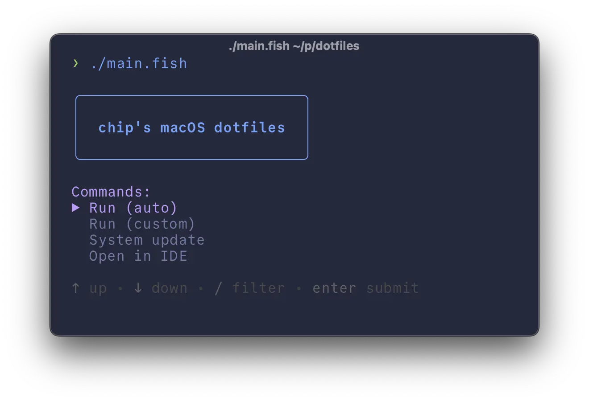

## The problem

I had a lot of configuration files on my laptop and no way to manage them. I needed a simple and replicable setup that required minimal maintenance.

Before I settled on a manual approach, I tried several different dotfile managers:

- [NixOS](https://nixos.org/), [nix-darwin](https://github.com/LnL7/nix-darwin), and [home-manager](https://github.com/nix-community/home-manager): By far the most popular solution, and for a good reason. However, I decided to wait until I bring my servers under the Nix umbrella before making the switch on my laptop. Otherwise, I really think this is the best solution that exists for this use case as it ticks all the boxes.

- [chezmoi](https://www.chezmoi.io/): Seems to be the most popular non-Nix solution. It has outstanding password management support and a variety of robust features, but I personally found the overall complexity and spotty documentation hard to justify over just learning Nix at that point (let alone just sticking with git).

  One major abstraction over `git` is that it stores your dotfiles in a dedicated "source" directory (i.e `~/.local/share/chezmoi`) that must be manually synced with their "destinations" using `chezmoi apply`. Like most things, you can automate the process, but it's not actually clear what benefit these abstractions provide for most users.

  It's also not great if you want to manage dotfiles outside of your home directory, which is a hard sell on a platform like macOS where even \*nix-native applications like [Godot](https://godotengine.org/) disable optional usage of XDG compliant config directories on non-Linux/BSD systems. Overall, unless you're allergic to Nix and have a need to bootstrap systems on a biweekly basis, it would probably make it _harder_ to manage your dotfiles, if anything. I'm sure it's popular for a reason, though.

- [Rotz](https://volllly.github.io/rotz/): I think I found this one on Hacker News or something. It suffered from the same problems many other dotfile managers have of not providing actual use cases, examples, or justification for using it over git/shell scripts.
- [yadm](https://yadm.io/): Seemed promising, but didn't work on my system.
- [GNU Stow](https://www.gnu.org/software/stow/): Old reliable, but a little crusty.

## My solution

Shell scripts and git.

<video width="100%" controls>
  <source
    src="https://github.com/user-attachments/assets/349cf1be-8d9a-4163-8b42-4dd68460c806"
    type="video/webm"
  />
  Your browser does not support the video tag.
</video>

I know, not the most innovative solution. But boy howdy does it work!

I'm not here to sell anything or present my setup as some standard, it's just what worked for me in the moment. But here's why I like it:

- It does everything I need it to do
- It only requires basic knowledge of git and shell scripts
- It's idempotent and can be run on a fresh or existing installs
- It's modular and dead simple to maintain or extend
- It uses the chad [fish](https://fishshell.com/) shell vs. a virgin POSIX-compliant shell for scripting

### How it works

Everything in my [dotfiles repo](https://github.com/fractalcounty/dotfiles) can be broken down into three main categories:

1. **Dynamic configs**: Dotfiles that live in `~/.config/` whose effects are immediately visible upon editing
2. **Static configs**: YAML manifests that manage things such as macOS system settings that have to be applied manually
3. **Scripts**: [Fish](https://fishshell.com/) scripts that symlink the dynamic configs and apply said static configs

Here's the default setup out of the box as of the time of writing:

- **OS**: [macOS Sequoia 15.1](https://www.apple.com/macos/macos-sequoia-preview/)
- **Terminal**: [ghostty](https://github.com/ghostty-org/ghostty)
- **Shell**: [fish](https://fishshell.com/) with the [Starship](https://starship.rs/guide/) prompt
- **Package Manager**: [brew](https://brew.sh/)
- **Theme**: modified version of [Tokyo Night Storm](https://www.vscolors.com/themes/1cac7443-911e-48b9-8341-49f3880c288a-03f6b671)
- **Editor**: [Micro](https://micro-editor.github.io/)
- **IDE**: [Visual Studio Code Insiders](https://code.visualstudio.com/insiders/) and sometimes [Cursor](https://cursor.sh/)
- **Launcher**: [Raycast](https://www.raycast.com/)
- **SSH/Secrets Manager**: [1Password](https://1password.com/)
- **System Settings Manager**: [macos-defaults](https://github.com/dsully/macos-defaults)

For a full, always-updated list of programs I use, check out the [Brewfile](https://github.com/fractalcounty/dotfiles/blob/main/Brewfile).

### Setup, usage, and technical info

If you want to see how it all works under the hood, or are brave enough to adapt it to your own needs, you can check out the [github repo yourself](https://github.com/fractalcounty/dotfiles).
