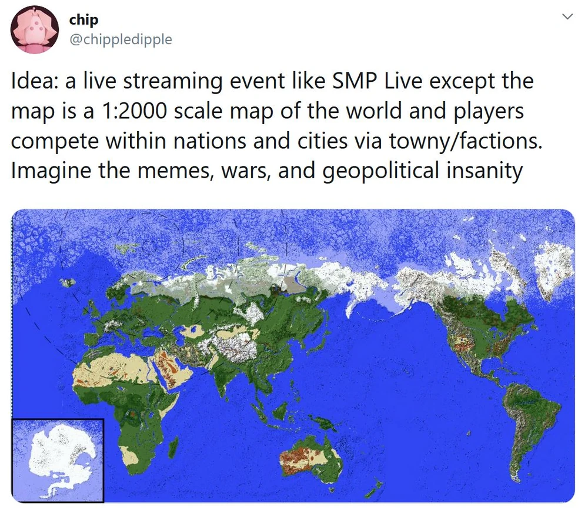

import { YouTube } from 'astro-embed';

SMPEarth was a Minecraft server set on a scale map of Earth that I hosted when I was in high school. Despite being a private server mostly tailored for creators to livestream on, it had a shockingly complicated history and behind-the-scenes drama. Unsuprisingly, it was my first real experience with developing and hosting a project on the internet.

---

# The Genesis of SMPEarth

_or "how to host a Minecraft server for your friends"_

SMPEarth was the direct successor of two other Minecraft servers:

1. [SMP Live](https://youtube.fandom.com/wiki/SMPLive), a private SMP with a similar premise based around live-streaming which was approaching the end of its life at the time.

2. [/int/craft](https://intcraft.wiki/), a geopolitical roleplaying Minecraft server founded in 2015 by users of 4chan's [/int/](https://www.4chan.org/) board that has had various iterations over the years.

_intchan, mascot of /int/craft_

The idea for SMPEarth emerged shortly after I had become acquainted with some of the original members of SMP Live. They were disappointed that the SMP was slowly losing traction despite Minecraft's momentary resurgence in popularity.

Coincidentally, around the same time, I was reminded of a controversy surrounding a user I played on /int/craft with, [WolfDevon](https://intcraft.wiki/wolfdevon/), who had [converted to Islam and murdered his neo-nazi roommates](https://www.rollingstone.com/politics/politics-news/all-american-nazis-628023).

Also, I just really wanted to play Minecraft with my friends.

## Foreword

This article is largely an accumulation of a few personal writings about the project that I've collected over the years.

Although I originally planned on editing it down for clarity and accuracy, I've decided to leave it as is for the sake of preserving the opinionated nature of the original as it once existed.

The rest of this page's content is best interpreted as a personal diary entry than a definitive overview of the history of the project's development.

## Let there be Earth

After running the idea by my friends, I began work on the project by creating the world map in [WorldPainter](https://worldpainter.net/). I quickly realized that this was a herculean task for a single person, so I instead opted to borrow and modify the map from [/int/craft](https://intcraft.wiki/intcraft) created by [ChienAndalou](https://intcraft.wiki/chien). Luckily, they didn't seem to mind that much aside from a few people giving me grief for "turning the server into some gay YouTuber shit". A lighthearted comment compared to /int/'s usual banter.

In the meantime, I had already started working on the software side of SMPEarth. Settling on a basic [Paper](https://papermc.io/) server bootstraped by some bog-standard plugins, it was nothing elaborate, especially for a server of its size.

<YouTube id='yyezbVbQeHY' />

Although I was the creator of SMPEarth from a technical perspective, actually getting the project off the ground was a group effort of many of my friends. The biggest catalyst of its creation was [JunkyJanker](https://www.youtube.com/@JunkyJanker), who played a massive role in providing ideas and pitching the project alongside our friend group. As to avoid sounding like I'm retroactively flexing the clout I had when I was a sophomore in high school, I'll just say that it was a collaborative effort of many people.

---

**10/5/2024 Edit:** Unfortunately, like most projects involving a massive group of content creators, SMPEarth's history is also marred by controversy involving many of the original members. Perhaps one of the best examples is [Wilbur Soot](https://en.wikipedia.org/wiki/Wilbur_Soot), who is currently in the midst of some [pretty harrowing allegations](https://www.themirror.com/entertainment/celebrity-news/wilbur-soot-apology-shubble-allegations-362564). I had about as good of an experience that a teenager can have with a content creator over the internet, so I have nothing to report or any insight to offer on that one. For our story's sake, he was the person who essentially sponsored SMPEarth by getting the bulk of creators from SMP Live on board.

---

## The Dawn of Eden

Up until this point, I had been hosting the development environment for SMPEarth on my own computer. For the purposes of testing amongst a few friends, it worked just as good as even the priciest dedicated server since Minecraft's infamously single-threaded design bottlenecked even on my consumer-grade CPU.

However, once I got news that Wilbur wanted the server open to hundreds of streamers in less than a month, it became apparent that a more robust hosting solution was needed. There were two massive problems with the situation I found myself in:

- Minecraft's poorly optimized network code meant that optimization was a serious concern.
- A dedicated server was needed for bandwidth and resources.
- I was in high school and couldn't afford a dedicated server, even with a consumer-grade CPU.

So, I reached out to Wilbur. He then got in touch with [JoshA20](https://smpearth.fandom.com/wiki/JoshA20), who was the current admin of Wilbur's own server, SootMC. Before I could even blink, JoshA20 was onboard as the second admin and had already gotten a sponsorship lined up with a small server hosting company. For legal reasons, I'll hereby refer to the company as "AbsoluteMC"

## The Serpent in the Server

Any time someone comes out of nowhere to eagerly agree to help manage your massive project, you should be suspicious.

Any time someone comes out of nowhere to eagerly agree to help manage your massive project and immediately gets a sponsorship lined up with a relatively unknown server host, _while still making you partially pay for the server out of pocket_, you should be extra suspicious.

I know that it seems obvious in hindsight, but I didn't know any better. I was too young and inexperienced to realize that someone was taking advantage of me.

## The Fall of Eden

Because AbsoluteMC is still an active company, I'm going to avoid making any claims or accusations against their business practices. Additionally, gathering proof would be a monumental task with how little information was archived.

I'll just say that I didn't get what I paid for.

For starters, I got a server that couldn't even handle half of the players it was supposed to on day one. This is almost to be expected for Minecraft's notoriously bad network stack, as even the beefiest dedicated servers can barely handle 100 players.

---

**10/5/2024 Edit:** Since the time of writing, several innovations in Minecraft server software have improved performance to the point where this is less of an issue than it was back then, e.g. [Folia](https://papermc.io/software/folia) which utilizes regionized multithreading and has been used to [support thousands of concurrent players](https://cubxity.dev/blog/folia-test-june-2023) as early as 2023.

---

I also got a server that suffered numerous incidents of _complete data loss_ with zero explanation provided, which required me to rebuild the entire server from scratch using backups of the massive map.

Despite the endless technical issues, my benefactors who graciously provided me with a discounted server were little help. In fact, I'd go as far as to say that I knew more about server hosting as an incompetent 17 year old than the people who were getting paid to manage the server. While dedicated servers often come with the expectation that the client will shoulder the brunt of the work, JoshA20 was appointed as an admin for this very reason- to allow me to focus on everything _but_ the backend.

As I came to learn later, he was much more than just an enthusiastic customer of AbsoluteMC as I was initially led to believe.

## Lucifer Unmasked

To cut a long story short, I don't even know if JoshA20 was a real person.

At one time, I genuinely believed that he was a false identity created to astroturf the hosting company's service. Although I wouldn't dare to go _that_ far, mostly for legal reasons, I'd be lying if I said that I wasn't suspicious of his true intentions. To name just a few oddities:

- He dissapeared from the face of the internet sometime after SMP Earth ended.
- He had minimal online presence outside of work with AbsoluteMC.
- He was undoubtedly an undisclosed employee of AbsoluteMC, whether that be in a literal capacity or an effective one as some sort of weird family friend or something.
- Other than being Welsh or something, he gave incredibly inconsistent and contradictory information about his identity, at times suggesting that he was _younger than I was_ (especially concerning on top of the previous point)

_a tweet in which JoshA20 claims to be the first customer of AbsoluteMC_

Due to the nature of the "sponsorship" and mounting pressure from Minecraft YouTubers that I used to practically pray to every night, I took total responsibility for the issues and spent every waking hour of my life keeping the server held together with what little Adderall I had. It even got so out of control that I was flunking out of high school for a project I was _paying_ to maintain.

### JoshA20's Temptation

One of the most notable warning signs in regards to this JoshA20 character was his intense fixation on the server's community management and branding. He had a keen interest in marketing the server as a professional endeavor, one that I felt didn't resonate well with the community or the creators (especially coming from SMP Live).

A good example was the branding. I had viewed SMPEarth with the mindset of a humble project that was thrown together by a ragtag group of friends with a shared hobby. He, however, viewed it as a "platform" for creators to make money and become famous. This difference in perspective can be seen in the server's hilariously inconsistent branding:

_An in-game recreation of Epstein temple in the header of SMP Earth's otherwise official-looking twitter page_

Eventually, the topic of creating a public server came up. I was initially all for the idea, even suggesting that it would be a fantastic way to _make money_ off of the server (assuming it would be put back into making the server) so I wouldn't need to keep borrowing from whatever savings I had at age 17.

Another idea brought to the table was the creation of a merch store for SMP Earth. While I was much more hesitant to this idea, I was eventually convinced by promises that the money would go towards the artists and creators and be used to fund the server. Obviously, I had no problem with that if it meant I could stop eating into my college savings.

However, in hindsight, JoshA20 seemed a little _too_ eager to make SMPEarth into a commercial product.

### Chip Makes SMPEarth Into a Commercial Product

Okay, yeah this one's stupid, but I'd be a hypocrite if I didn't mention it.

Halfway through SMP Earth's lifespan, I ran out of money to keep paying for the server. I didn't need a lot of money- just about $100 to keep the server running for a bit longer. So I had a genius idea: I'd make a Patreon with a role that would give the top donator spectator access to the server on a seperate proxy during special events.

As you can imagine, the idea was poorly recieved. I didn't communicate the fact that the user would essentially just be watching the livestreams from a different angle using the in-game spectator mode, and it was interpreted as me selling literal access to the server (which I guess I was doing in a literal sense). I genuinely don't remember if anyone actually bought the role- I want to say someone did but I refunded it. Either way, pretty much everyone told me I should abandon the idea, which I did before the Olympics event.

Most damningly, the fact that it was through my personal Patreon really didn't help. I didn't try to pass it off under the guise of "supporting creators" or anything- it was straight up just "give money to me since I created the server" which came across as self-serving. Which I mean, it kind of was.

My only excuse was that if I had wanted to make money off of the server, I would've just used it to launch a streaming career like everyone else was. I already had a decently popular YouTube channel that was rapidly growing at the time, and even putting the bare minimum amount of effort into streaming on the server would've been insanely lucrative given that I was the owner (just look at Dream!). I think this has only become more apparent as time has gone on, considering YouTubers like [TommyInnit](https://www.youtube.com/@TommyInnit) singlehandedly kickstarted their career on SMPEarth. Personally, I just never got anything out of streaming and was mostly in it for the fun. But I digress.

Unfortunately, this was probably the biggest mistake I made that singlehandedly lowered people's trust in me. Up until this point, most of AbsoluteMC's previous influence on the server couldn't be directly attributed to me, and this incident had the unintended side effect of bolstering JoshA20 and AbsoluteMC's standing in most people's eyes as people who stood opposed to making SMP Earth into a commercial product.

### JoshA20 Actually Makes SMP Earth a Commercial Product

My lapse in judgement opened the door for JoshA20 (and arguably AbsoluteMC depending on who you ask) to slip monetization efforts into SMPEarth. The most notable examples are the merch store and the public server.

The merch store was a weird one and isn't something I can speak confidently about. Like I said earlier, I was skeptical of whether we had the logistical capabilities to handle an entire storefront operation (having just two people, after all), but I was convinced once I was assured the money would go towards the artists and funding the server. As far as the artists go, to this day I still have no idea if they got paid or not. I wasn't privy to the details to the merch stuff and was far too preoccupied to get involved. All I know is that the endavour didn't tangibly offset server costs or operational burden like it was promised to. I'm skeptical.

The public server was a different story. I had absolutely zero involvement from day one and have no idea about the details of its creation. All I know is that it was fully spun off from my server as a for-profit business venture once they removed me from the picture, fully adopting the same branding and premise as the original (even using the same domain name!). To this day, it maintains thousands of active members in the Discord and is still going strong. I have no idea if it's still ran by the same people, but I'm sure it's made more money than I'll ever see in my lifetime.

### A Tale of Two ARGs

On a much funnier and lighthearted note, JoshA20 was also a bit of a copycat. I almost didn't want to include this because it's so petty, but I'll do it anyway for the sake of completeness.

One of my favorite aspects of SMPEarth was the [crappy little ARG](https://smpearth.fandom.com/wiki/Laramie_Online) I threw together. It was probably the worst ARG in the history of ARGs, but I had a lot of fun with it and it helped add a sense of depth to the project that was somewhat lost with AbsoluteMC's opressive branding.

For as amateurish as it was, I think a lot of people enjooyed it for what it was.

In fact, JoshA20 thought it was _such_ a good idea that he started [his own ARG](https://smpearth.fandom.com/wiki/7_ARG) on the same server, at the same time, with the same premise.

Needless to say, this was insanely confusing and pretty much killed all traction the ARG had. At risk of sounding petty, this is the moment I started questioning everything and wondering why I was even doing this.

### The Construction of the Tower of Babel

_or "Chip Tries to Give Money to Gay People"_

Rife with fear that the project was heading towards a slow decline and a legacy of profit-seeking mediocrity, I figured that some sort of charity event would be a good way to redeem the server's purpose as a casual, non-profit Minecraft server while doubling as a finale of sorts.

We started work on the [Olympics Event](https://smpearth.fandom.com/wiki/SMPEarth_Olympics), which rivaled the server itself in manpower and effort. We spent over a month building the stadium and preparing the server for the event. For all the server's issues, this was probably the most fun I had working on the project.

While planning was underway, I had come up with the idea to use the event to raise funds for the [The Trevor Project](https://www.thetrevorproject.org/), a nonprofit organization focused on suicide prevention efforts amongst LGBTQ people. This wasn't just for superficial reasons such as the community having a lot of gay people or thematic consistency with my [Laramie Online ARG](https://smpearth.fandom.com/wiki/Laramie_Online), but because I and many others I knew had genuinely benefitted from the organization's support when I was younger. Everyone seemed super on board with the idea, so we went ahead with the idea as we finished preparations for the finale event.

### What JoshA20 Was Doing

Don't get me wrong, JoshA20 was absolutely doing _something_. He was arguably more active on the community management side of things than I was, and he frequently took it upon himself to fix the server whenever things inevitably broke. To suggest that he was useless or lazy would be a gross understatement, as he did objectively carry a lot of the weight of the project on his shoulders.

I just don't think he was in it for the right reasons.

_a chatlog of some of the first core SMP Earth members discussing JoshA20's role in the project_

Obviously, to some degree, he was a real person. Sure, he only raised more questions than he answered about his own existence, but still. We had an amicable working relationship with little tension, and I'd probably have the same opinion to this day if it wasn't for what happened shortly after.

Meanwhile, while things were seemingly improving as we worked on a finale event to look forward to, I fell back into one of my worst addictions: Making snarky and inflammatory tweets. This time, it was towards a particularly troublesome group of fans that were growing at an alarming rate.

Little did I know that the group I was antagonizing was the very same group that would serve as the community's own "forbidden fruit" in the years to come...

## The Dawn of Stankind

Before Minecraft YouTubers had a reputation for having fanbases full of 12 year old girls, they had a reputation for having fanbases full of 12 year old boys. Who was the catalyst? I don't know. Probably Wilbur Soot- no offense. I just know the shift occured sometime inbetween the end of SMP Live and the beggining of Dream SMP, placing SMPEarth right at ground zero.

In case you aren't intimately familiar with these communities, it's worth emphasizing that the group of people I'll be discussing, hereby referred to as "stans", are a distinct group of people from "fans of Minecraft YouTubers".

Although there was some overlap, the two groups were about as different as Adam and Eve. And like Adam and Eve, one of them was doomed to fall from grace shortly after their creation.

At the time, Minecraft stans were a new but growing subculture within the Minecraft YouTuber community. Nearly everyone I knew unanimously recognized them from their distinct philosophies towards content creators and whether or not they could be considered real people. It was a level of obsessive dehumanization that was rarely seen outside of the most corporate of boy bands and K-pop idol scenes.

Personally, I thought they were antisocial, harmful, and, worst of all, annoying - a view I continue to hold to this day. My personal justifications for these beliefs is far too long to fit within the scope of this writing, but just to name a few that occured within the first months of me being aware of the community's existence:

- I was the target of uncomfortable fanfictions involving friends of mine, one of which was fifteen years old.
- Members of the stan community were drawing pornographic images of other creators on the server.
- Stans would justify their dehumanizing behavior with a laundry list of excuses such as "trauma" and "coping mechanisms".
- Stans were professional victims who felt zero shame in leveraging their identity (mental health, sexuality, gender, race, age, etc.) to harass creators who didn't meet their impossibly high standards (essentially, allowing stans to be use them like playthings as they saw fit).
- The stan community was (and still is) overall a very strange group of people who truly believed they were entitled to dehumanize real people for their own entertainment at their own discretion.

_Screenshot of me antagonizing teenage girls in 2019. Old habits die hard, I guess._

I felt justified in my repeated tirades against the stan community, as they were the ones making other creators question if it was even worth continuing to make Minecraft content anymore. I, and many others involved in the community, were under the genuine belief that the stan community was a very small subculture that could be easily marginalized and snuffed out. There was an earnest opposition to the stan community from a good chunk of the Minecraft YouTuber community. Nobody knew what was to come.

### The Forbidden Fruit

Most of the creators I knew were under the impression that the stan community was an anomaly that would die out once they were deprived of attention. That was until a few enterprising creators group came to the same realization that record labels came to in the 90s:

> Holy shit, teenage girls are a goldmine!

If the death of SMP Earth was caused by my own incompetence, the rise of the MCYT stan community was the result of a subset of creators realizing that it was easier to pander to preteens than it was to get them to stop drawing porn of your friends.

Like all good ideas in a capitalist society, this philosophy quickly came to dominate the scene. It eventually split off and carried on through its own entity: the insanely successful money printer that was [Dream SMP](https://www.youtube.com/c/dream).

Regardless, while this development was still in its earliest stages, I continued to antagonize the stan community in whatever time I had that wasn't consumed by server maintenance.

## Dark Night of the Soul

Between the state of the community and the internal issues with the server, I quickly became disillusioned with the project and lost all interest in maintaining it. To name a few reasons:

- I was paying to work a full-time job...
- ... that was making me flunk out of high school
- ... to entertain a community of insane teenage girls
- ... just so I could play Minecraft with my friends

While it was objectively a hell of my own creation, to this day I still feel that it would've been unsustainable for anyone who somehow found themselves in a similar situation at that age.

As the workload only increased, I quickly burned out and neglected my duties more and more. Instead of doing the smart thing by downloading the server files and high-tailing it to a new server host, I pussyfooted around the issue out of fear of upsetting the hosting company and the creators relying on the server to put food on the table (exact quote of what I was told).

Meanwhile, the situation with the stan community escallated to the point that a few creators on SMP Earth asked me to setup a Twitter blocklist that would esentially put an embargo on the entire stan community (since they were clearly incapable of policing themselves). I quickly jumped into action and announced the blocklist in a now-deleted tweet. Although I can't defend the unprofessionalism of my teenage self up until this point, what happened next is genuinely still outrageous to me to this very day.

## Paradise Lost

As a result of the blocklist, I was ousted from the project by JoshA20 and AbsoluteMC. I was left without access to the server files and the official Twitter. In a now-deleted tweet, they announced the reason for my "dismissal":

In an instant, it was over. I was almost relieved, but mostly embarassed that I let my server fall victim to what was essentially a hostile take-over.

As far as the "threatening to dox/attack 1,000+ users claim" goes, it was essentially just a convienient lie to justify the coup d'etat. There was absolutely zero evidence to suggest that the blocklist was anything more than a petty attempt to bar unsavory individuals from the community, let alone a coordinated harassment campaign.

After the initial lie had already spread and done its damage, it was further fueled by a sarcastic comment I had made: In response to someone accusing me of "encouraging the doxxing of minors", I sarcastically responded with a "... Yeah.", naturally only making things worse. In my defense, it was such a ridiculous claim that I couldn't not joke about it.

Beyond that, there's really not much else to it. It was over before it even began.

It took awhile for any real resentment to build up, but what really kickstarted it was how the project was handled after my sudden dismissal. Some key examples:

_JoshA20 made a complete 180 on his public opinion of me, going from a friendly collaborator to a bitter enemy in the span of hours once the project was under his control_

_JoshA20 lied about my role in the project, declaring that I never actually contributed anything to the project in the first place and that he did the majority of the work._

_JoshA20 made repeated bizaare allegations against me to other creators, one of which being that I "neglected the project due to a weed addiction" and that I had enthusiastically discussed cannabis with my 15 year old friend._

_JoshA20 then had the gall to plead with creators to stick around for the finale event after he had taken the entire server hostage at the last minute._

Worst of all: JoshA20 not only took credit for the charity idea, but proceeded to tell everyone that I had actually stolen the idea from _him_ and tried shutting it down because I was homophobic.

---

### Paradise Regained?

**Note:** This section was written in October of 2024.

It's always a little embarassing to revisit the past, especially when it involves something as trivial as a Minecraft server. As silly as it sounds, I viewed it as one of the most important things in the world at the time, which made it all the more painful when things inevitably fell apart. (I've definitely learned to tone down the self-importance since then, but I still have my moments.)

For as negative as it may have sounded, it wasn't all bad. Even at the time of writing, I genuinely look back fondly on my time working on SMPEarth and had an insane amount of fun. In a way, I fulfilled my original goal of simply wanting to play Minecraft with my friends.

I just got more than I bargained for, for better and worse.

_One of the first interactions I had with Bedhead Bernie_

I met some of my best friends through SMPEarth and made too many good memories for me to simply write it off as a mistake. Without turning this into a personal diary, my life would look radically different I wasn't in the mood to play Minecraft with some friends during the early months of the 2019 COVID pandemic.

Instead, I now view it was a series of mistakes that I'm glad I was able to make. Although I obviously haven't learned anything since then, hopefully someone else can learn from those mistakes.

Just maybe stay away from Minecraft.
